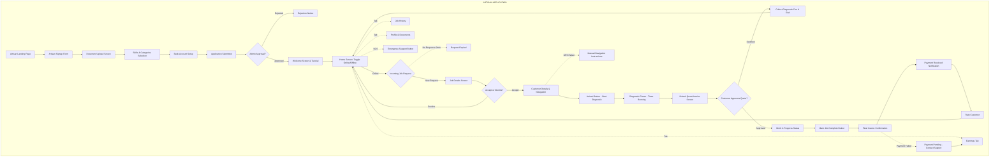

```mermaid

    graph TD

    %% ========== ARTISAN SIDE ==========
    subgraph Artisan_Flow["ARTISAN APPLICATION"]
        A_A[Artisan Landing Page] --> A_B[Artisan Signup Form];
        A_B --> A_C[Document Upload Screen];
        A_C --> A_D[Skills & Categories Selection];
        A_D --> A_E[Bank Account Setup];
        A_E --> A_F[Application Submitted];
        A_F --> A_G{Admin Approval?};
        A_G -- Rejected --> A_H[Rejection Notice];
        A_G -- Approved --> A_I[Welcome Screen & Tutorial];
        
        A_I --> A_J[Home Screen: Toggle Online/Offline];
        A_J -- Online --> A_K{Incoming Job Request};
        A_K -- New Request --> A_L[Job Details Screen];
        A_L --> A_M{Accept or Decline?};
        A_M -- Decline --> A_J;
        A_M -- Accept --> A_N[Customer Details & Navigation];
        
        A_N --> A_O[Arrived Button - Start Diagnostic];
        A_O --> A_P[Diagnostic Phase - Timer Running];
        A_P --> A_Q[Submit Quote/Invoice Screen];
        A_Q --> A_R{Customer Approves Quote?};
        A_R -- Declined --> A_S[Collect Diagnostic Fee & End];
        A_R -- Approved --> A_T[Work in Progress Status];
        
        A_T --> A_U[Mark Job Complete Button];
        A_U --> A_V[Final Invoice Confirmation];
        A_V --> A_W[Payment Received Notification];
        A_W --> A_X[Rate Customer];
        A_X --> A_J;
        
        A_J -. Tab .-> A_Y[Earnings Tab];
        A_J -. Tab .-> A_Z[Job History];
        A_J -. Tab .-> A_AA[Profile & Documents];
        A_J -. SOS .-> A_AB[Emergency Support Button];
        
        A_N -. GPS Failed .-> A_AC[Manual Navigation Instructions];
        A_K -. No Response 2min .-> A_AD[Request Expired];
        A_V -. Payment Failed .-> A_AE[Payment Pending - Contact Support];
        
        A_S --> A_J;
        A_AE --> A_Y;
    end
```