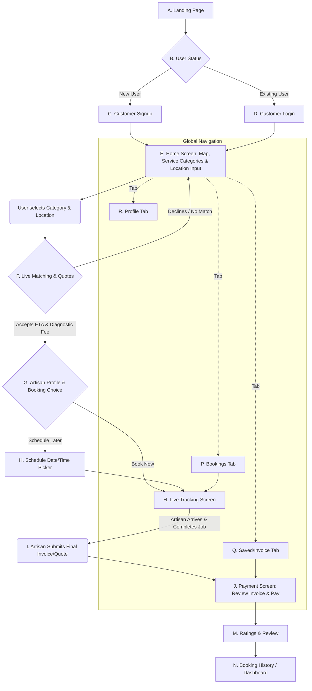

# HomeSure 
### Your Trusted On-Demand Mobile Service Delivery Platform.
HomeSure is an on-demand service delivery platform that connects households and businesses with trusted artisans for essential services such as plumbing, carpentry, electrical repairs, cleaning, and more.

It functions like an "Uber for Trades," providing immediate, doorstep access to professionals across a wide range of categories, including:

* **Home Services:** Plumbing, Carpentry, Electrical Repairs, HVAC, Cleaning.
* **Tech Services:** Mobile Phone Repairs, Laptop Repairs.
* **Personal Services:** Barbing, Makeup Artists.
* **Logistics/Other:** Gas Refill, General Handyman services.

---

## Key Features

| Customer Experience | Artisan Experience |
| :--- | :--- |
| **Instant Booking:** Request a service immediately or schedule an appointment for later. | **Real-Time Job Queue:** Receive instant notifications for nearby, relevant service requests. |
| **Real-Time Tracking:** Track the artisan's ETA and location on a live map. | **Flexible Work:** Accept or decline jobs based on location and schedule. |
| **Transparent Pricing:** Receive in-app quotes for approval before any work begins. | **In-App Quoting & Invoicing:** Generate and submit professional quotes and invoices directly to the customer. |
| **Secure Payments:** Integrated payment gateway for seamless, cashless transactions. | **Verified Payouts:** Track earnings and receive automated, scheduled payments. |
| **Ratings & Reviews:** Rate the service to ensure quality control across the platform. | **Professional Profile:** Manage certifications, service portfolio, and track performance metrics. |

---

## Technology Stack

HomeSure is built on a modern, scalable architecture designed for real-time responsiveness.

* **Customer/Artisan Mobile Apps:** [e.g., React Native, Flutter, Swift/Kotlin]
* **Backend & API:** [e.g., Node.js (Express), Python (Django/Flask), Go]
* **Database:** [e.g., PostgreSQL, MongoDB]
* **Real-Time/Mapping:** [e.g., WebSockets, Google Maps Platform / OpenStreetMap]
* **Payment Gateway:** [e.g., Stripe, Paystack, M-Pesa]

